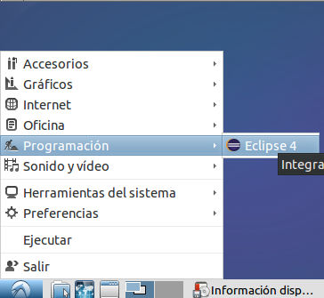
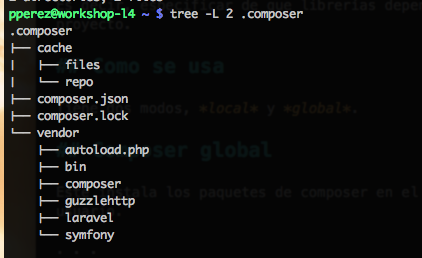
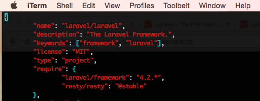

% Entorno de desarrollo
% Patricio Pérez <patricio.perez@ceinf.cl>
% Primer semestre 2015

# Entorno de desarrollo

## Que viene?

* Ubuntu
* Eclipse
* PHP/Composer/Laravel
* Git* (Lo dejaremos para el siguiente set de slides)

# Ubuntu

Ubuntu es una *distribución de linux* (Algo así como un sabor), es una de las más usadas según [Distrowatch](http://distrowatch.com/dwres.php?resource=popularity) y personalmente encuentro más amigable trabajar desarrollos en esta plataforma.

## Disclaimer

Creo que la instalación es bastante sencilla, asi que obviare temas como el particionado. Sin embargo, si tienen dudas no duden en dejarmelas ;)

## Línea de comandos

La querida terminal debería ser una de sus más grandes aliadas en este curso, así que tenganla a mano, la encontrarán como "terminal" y luce como las películas de hackers de los 80'.

## Superusuario

El super-usuario de unix es root, este puede hacer de todo en el sistema de ficheros, matar procesos y otras operaciones de sistema. Cada vez que necesiten ejecutar algún comando que tenga implicaciones en el sistema, deberán correr tal comando como root, para esto antepongan `sudo` al comando.

## Torpedo básico de comandos UNIX

- Usar **TAB** para completar comandos, nombres de ficheros, siempre que se pueda!
- `cd directorio` Ingresa a un directorio
- `cat fichero.txt` Muestra en pantalla el contenido de un fichero
- Cuando se trabajan directorios `.` se refiere al directorio actual, `..` se refiere al padre del directorio actual, de hecho `../..` entraria al padre del padre del directorio actual (abuelo??)
- Nuestro home (Donde se guardan todas nuestras leseras) es por defecto `/home/usuario`, un atajo es `~` (ej: ´~/Descargas´ equivale a ´/home/usuario/Descargas´)

----

- Usar apt para manejar paquetes es super sencillo:
    * `apt-get install paquete otropaquete` Instalar
    * `apt-get remove paquete otropaquete` Desinstalar
    * `apt-cache search palabra buscar php` Buscar paquetes, en descripción etc, pueden ser muchas palabras
    * `apt-get update` Actualiza la base de datos de paquetes
    * `apt-get dist-upgrade` Actualiza todos los paquetes del sistema
- Usar `sudo` antes de cualquier comando que necesite permisos de administrador (ej: instalar paquetes con apt, modificar ficheros en `/etc`, etc)

# Eclipse

[Eclipse](http://eclipse.org/) es un IDE desarrollado en Java, la extensión *PDT* (PHP Development Tools) nos permite trabajar con ... PHP.

## Instalar java

El IDE usa Java, así que hay que instalarlo, usaremos la versión 8 de Oracle:

~~~bash
sudo add-apt-repository ppa:webupd8team/java
sudo apt-get update
sudo apt-get install oracle-java8-installer
~~~

Aceptamos la licencia y listo, java java doo.

## Instalar eclipse (+ PDT)

~~~bash
wget http://carroll.aset.psu.edu/pub/eclipse//technology/epp/downloads/release/luna/SR2/eclipse-php-luna-SR2-linux-gtk-x86_64.tar.gz
sudo tar xzvf eclipse-php-luna-SR2-linux-gtk-x86_64.tar.gz -C /opt
sudo ln -s /opt/eclipse/eclipse /usr/local/bin
sudo wget http://git.io/VhjClg -O /usr/share/applications/eclipse.desktop
rm eclipse-php-luna-SR2-linux-gtk-x86_64.tar.gz
~~~

Incluso tendran el icono en el lanzador de aplicaciones.

---



# PHP, Composer, Laravel y Postgres

## PHP

Instalaremos unas cuantas librerias de php, las mínimas para trabajar con el framework.

---

~~~bash
sudo apt-get install php5-curl php5-mcrypt php5-cli
sudo php5enmod mcrypt
~~~

# Composer

Aquí me detendré un poco, veamos que hacer composer!

## Usando Composer


## Que es Composer

*Composer* es un manejador de dependencias para *PHP*.

. . .

Es decir, especificar de que librerías depende nuestro proyecto.

. . .

Se puede ver el listado de paquetes disponibles en composer en [Packagist](https://packagist.org/)

## Instalar composer

~~~bash
wget -O - https://getcomposer.org/installer | php
sudo mv composer.phar /usr/local/bin/composer
~~~

## Como se usa

Tiene dos modos, *local* y *global*.

## Composer global

Este instala los paquetes de composer en el *home* del usuario.

. . .

```bash
composer global require "laravel/installer=~1.1"
```

. . .



## Composer local

Este instala los paquetes en el directorio `vendor` del proyecto, las dependencias se definen en el fichero `composer.json` en la raiz del proyecto

. . .

~~~bash
composer require resty/resty:@stable
~~~

. . .


---



## Composer y git

Cuando generan un proyecto con el instalador de laravel, se incluye un fichero `.gitignore`, este hace que git ignore ciertos ficheros, entre ellos se incluye todo el directorio `vendor`, ya que al hacer el `composer update` se instalan las librerías, haciendo innecesario tenerlo en git.

## Resumen Composer

1. Instalar composer
2. Añadir librerias usando `composer require` o modificando `composer.json`
3. Ejecutar `composer update` en la raiz del proyecto para instalar las librerías
4. Profit!!

# Volviendo a laravel y postgres

## Laravel

Como estamos trabajando con Laravel 5, la forma más sencilla y rápida es usando el instalador de laravel. Si necesitan instalar una versión específica, deberán usar composer, mi blog tiene info de eso...

## Instalar el instalador

Suena mal, pero es la verdad, para esto debemos agregar `export PATH="$HOME/.composer/vendor/bin:$PATH"` a nuestro `.bashrc` o `.zshrc`, luego recargar la terminal y ejecutar:

~~~bash
composer global require "laravel/installer=~1.1"
laravel new proyectoso
~~~

El proyecto estara en el directorio `proyectoso`

## PostgreSQL

Al profe le encanta postgres (Algunos dirían que la raya con postgres...), así que eso usaremos.

## Instalar Postgres

~~~bash
sudo apt-get install postgresql-9.3
sudo apt-get install php5-pgsql
~~~

## Crear usuario y db

~~~bash
sudo -u postgres createuser --no-superuser --pwprompt miprimeradb
sudo -u postgres createdb miprimeradb
~~~

<div class="notes">
Si el nombre de usuario coincide con el de la db tendrá todos los permisos listos.
</div>

## Abrir el proyecto en Eclipse

<div class="notes">
Cambiar el filtro para que se muestren los ficheros ocultos
</div>

Para abrir el proyecto en Eclipse, basta que pinchemos en crear nuevo proyecto de php, le damos que tenemos un directorio ya existente y listo.

## Agregar el repositorio de github

Usaremos la línea de comando:

~~~bash
cd code/proyectoso
git init
git remote add origin git@github.com:pperez/demol5.git
git add .
git commit -m "Commit inicial, laravel 5"
git push -u origin master
~~~
