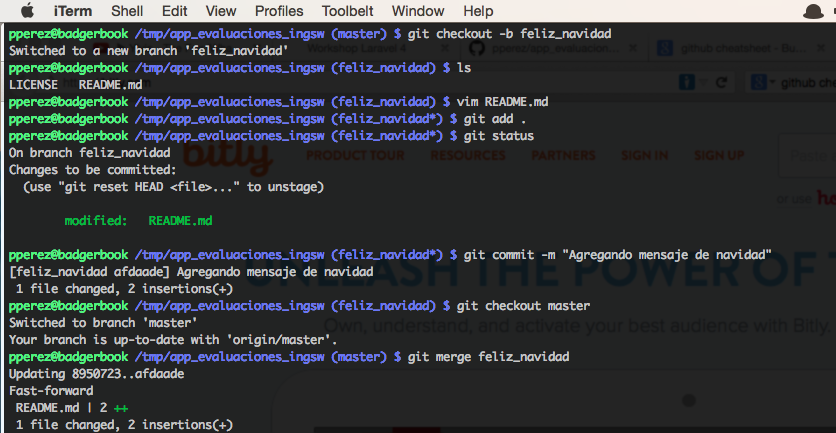

% Control de versiones
% Patricio Pérez <patricio.perez@ceinf.cl>
% Primer semestre 2015

# Control de versiones

## Para que?

Cuantas veces les ha ocurrido esto?

----

## Control de versiones

Un *VCS* (Version Control System) registra los cambios realizados a su proyecto, permitiendo volver a versiones especificas a lo largo del tiempo.

## Características

* Revertir un fichero o todos a una revisión específica.
* Realizar una comparación entre dos revisiones.
* Conocer quien ha realizado cambios (problemáticos) sobre un fichero en particular.
* Cuando se introdujo un bug (o feature) al proyecto.

# Tipos de VCS

## Tipos de VCS

Existen tres tipos de *VCS*:

## Locales

Son los abuelitos de los VCS, mantienen una base de datos local con todos los registros, no hay una forma sencilla de tener colaboración con más gente.

----

---

Ejemplos: [RCS](https://www.gnu.org/s/rcs/), [Quma Version Control System](http://en.wikipedia.org/wiki/QVCS).

## Centralizados

La necesidad de colaborar fue la que requirió la transición hacia un *CVCS* (Centralized Version Control System), estos muestran un servidor único que contiene todos los ficheros versionados, y multiples clientes que piden ficheros desde este.

Ganancia:
* Todos ven lo que el resto esta haciendo, hasta cierto punto.
* Control granular de permisos/acceso.

---

## Problemas de los VCS centralizados

* Si el server dice #ahilosve estamos sonados hasta que vuelva
* Si el server murio y no hay backups, no hay forma de restaurar el proyecto (con todas las versiones). #ahilosve
* Toda operación le pega al server, si no hay internet/acceso cooperamos.

* Punto único de fallo.
* Integridad de datos.
* Si no se puede acceder al server estamos fritos.

---

Ejemplos: [CVS](http://www.nongnu.org/cvs/), [Subversion](https://subversion.apache.org/).

## Distribuidos

Estos problemas llevaron a pensar un nuevo tipo de VCS, los *DVCS* (Distributed Version Control System), estos difieren en los centralizados en que los clientes guardan la copia completa del repositorio.

---

---

Ejemplos: [Git](http://git-scm.com), [Mercurial](http://mercurial.selenic.com/), [Bazaar](http://bazaar.canonical.com/en/).

# El que usaremos: git

## Que es git

Git es un sistema de control de versiones distribuido, usualmente un proveedor de la parte centralizada es [github](http://github.com), no hay que confundirlos.

----

----

## Es distribuido

* CVCS: "Centralized Version Control System" (ej: SVN, CVS)
* DVCS: "Distributed Version Control System" (ej: Git, Mercual, Bazaar)

Si se cae el servidor de github (Repositorio central en la imagen), aún pueden trabajar, hacer commits, consultar el log, crear branches (locales), y otras operaciones.

----

(Ojo! [Github](http://github.com) no es el único proveedor de git, está [bitbucket](http://bitbucket.org) y otros, incluso pueden alojarlo en un servidor propio, it's free!).

# Instalando git

## Crear la cuenta y configurar identidad

* El primer paso sería entrar a [github](http://github.com) y crear una cuenta
* Ahora debemos crear una llave ssh (Abran sus terminales y tipeen):

* ~~~bash
git config --global user.name "Patricio Pérez"
git config --globa user.email pperez@boaboa.org
git config --global color.ui auto
git config --global push.default simple
ssh-keygen -t rsa -C pperez@badgerbook
~~~

---

<video controls data-autoplay src="media/git01.webmsd.webm"></video>

## Agregar llave pública a github

- Ver el contenido de `~/.ssh/id_rsa.pub` y agregarla a Github (En la web 'Settings → SSH keys → Add SSH key')

---

## Crear repositorio

- Crear el repositorio ('Create new... → New repository')

. . .

- Puntos extras si saben como licenciar su proyecto!!

## Clonar el repositorio

Vamos a la pagina del repositorio y copiamos la URL de clonado SSH (Parte inferior derecha), luego en la terminal:

~~~bash
cd ~
mkdir code
git clone git@github.com:pperez/app_evaluaciones_ingsw.git
~~~

## Ta-Dah!

Su repositorio esta en `~/code/app_evaluaciones_ingsw`

# Comandos git

## Comandos git

- `git checkout -b nueva_rama` (Hace una nueva rama basada en la actual)
- `git commit -m "mensaje"` (Hace un commit con el mensaje especificado en el -m)
- `git checkout master` cambia a la branch que queramos
- `git merge otrarama` hace un merge de la otra rama, cuidado con los problemas de merge!

---

- El push requiere conexión al server (en este caso github)
- Hay que tener cuidado con los merge y como manejarlos

## Terminando con git

Eso sería lo básico, donde encontrar más:

. . .

Github tiene una buena sección de recursos ([https://help.github.com/articles/good-resources-for-learning-git-and-github/](https://help.github.com/articles/good-resources-for-learning-git-and-github/))

Selección personal:

- Cheatsheet (Torpedo) de git en español ([https://training.github.com/kit/downloads/es/github-git-cheat-sheet.pdf](https://training.github.com/kit/downloads/es/github-git-cheat-sheet.pdf))
- Pro Git ([http://progit.org](http://progit.org))
- Github Guides ([https://guides.github.com/](https://guides.github.com/))
- Gitflow ([
A successful Git branching model
](http://nvie.com/posts/a-successful-git-branching-model/))
