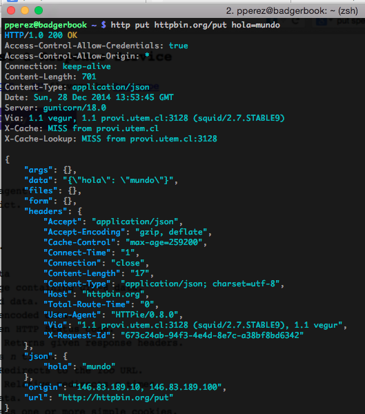

% Desarrollo Web
% Patricio Pérez <patricio.perez@ceinf.cl>
% Primer semestre 2015

# Desarrollo web

## Developers!!1cientoonce!

<video controls width=640 height=480 src="media/developers-developers-developers.webm"></video>

## Modelo cliente/servidor

Es lo que más usamos día a día, en facebook por ejemplo.

---

# Arquitectura HTTP

## Arquitectura HTTP

Implementa el modelo cliente/servidor, ojearemos un par de conceptos necesarios para entenderla:

* URIs
* Requests
* Códigos de estado
* Verbos HTTP

## URIs

Un *URI* es un identificador único de un recurso, ejs:

* `http://animales.com/perros/5`
* `http://animales.com/anguilas`
* `http://animales.com/anguilas/4/albinas`

## Requests

Un request o *petición*, se realiza a un recurso mediante su *URI* usando un **verbo http**.
Un request debe tener una respuesta, la que por lo bajo tiene un código (i.e: 500, 200, el infame error 404, etc) y otro tipo de información (headers), aparte de la respuesta.

## Verbos HTTP

Los verbos HTTP más utilizados son:

* `GET`
* `HEAD`
* `POST`
* `PUT`
* `DELETE`
* `PATCH`

## GET

Pide la representación de un recurso específico, el fin es obtener información, no debe haber otro efecto adverso.

---

## Head

Pide una respuesta, del mismo estilo que `GET`, pero sin el cuerpo de la respuesta. Útil para mostrar información en headers, notificar si hay cambios en el contenido (Es decir, ratear un poco de bandwidth al no transferir el body)

---

## POST

Envia información y realiza cambios en recursos, pueden crearse nuevos recursos, realizar cambios sobre recursos existentes. Esta es la acción que casi siempre hacemos al pinchar '`Enviar`' en un formulario.

---

## PUT

Tambien se envia información, sin embargo es más flexible, ya que se puede interpretar como la creación de un nuevo recurso, o la modificación de uno ya existente.

---

## DELETE

Creo que ya se imaginan que hace ...

## PATCH

Realiza modificaciones parciales a un recurso existente, hay que tener ojo, la especificación recomienda que los cambios enviados sean un tipo de diferencia, esta es parseada por el servidor y realiza los cambios pertinentes, al contrario de la creencia común, de enviar una `campo:valor` y esperar que se modifique solo tal campo en el recurso.

---

## Códigos de estado

<video controls width=640 height=480 src="media/http_status.webmsd.webm"></video>

## Patrones de diseño arquitectónico

Es una solución reconocida (*connotada*) a un problema recurrente de diseño (Como se ve la estructura de nuestra aplicación).
Entre sus dominios encontramos:

* Control de acceso
* Concurrencia
* Distribución
* Persistencia

## El que nos atañe: MVC

- Modelo: Objetos del mundo real, del dominio del problema, maneja datos, lógica y reglas de la app (ej: Usuario, Estudiante)
- Vista: Representación de salida al usuario (ej: HTML, JSON, XML, etc)
- Controlador: Lógica de interacción con el usuario, recibe, convierte datos e interactua con modelos y vistas

El patrón que utilizaremos será *MVC* o *M*odel *V*iew *C*ontroller, este separa la aplicación en 3 capas:

* Modelos
* Vistas
* Controladores

# MVC

## Modelos

Blog: (Modelos: Entradas, Usuarios, Comentarios)
Controladores: EntradasController, UsersController, ComentariosController

/entradas/\{id\}/comentarios
/usuarios/

Los modelos se refiere al conjunto de clases que representa nuestro dominio del problema (Relación con el paradigma orientado a objetos).

## Modelos

*Laravel* nos da una herramienta llamada *Eloquent* para manejar los modelos, estos tienen relación directa con nuestra base de datos (*Eloquent* es un *ORM*, este mapea objetos a filas de base de datos), el ORM automáticamente construira consultas para la base de datos.

## Modelos

El ORM permite trabajar los objetos, por ejemplo, `Modelo::all()` nos entregará una lista con todos los objetos de esa clase, `Modelo::find(5)` entregará el objeto cuya llave primaria sea igual a 5. Se pueden pedir otras cosas al ORM, como condiciones `WHERE` o consultar relaciones `1/n`.

. . .

En fin, si quiere más información, lo veremos prontamente, mismo horario, mismo canal.

## Controladores

Los controladores son la forma en las que interactuamos con la aplicación, en el caso particular de los frameworks web que implementan MVC las acciones se realizan a través de una URI y de verbos HTTP, ejemplos:

* `GET /perros`
* `POST /perros`
* `GET /perros/5`
* `DELETE /perros/10`

## Controladores

Cada ruta de la aplicación (URI) y un verbo http correspondiente deben mapear a un método de un controlador, los métodos de un controlador pueden no recibir parámetros (ej: un index) o recibirlos (ej: mostrar el recurso con id 5).

. . .

El encargado de mapear una URI + verbo a un método es el framework de `Routing` (El que veremos en detalle más adelante)

## Vistas

Es la representación de un recurso, presentada al usuario. Estás pueden tener distintos formatos, entre ellos:

* XML
* JSON
* HTML
* Otros

## MVC Overview

