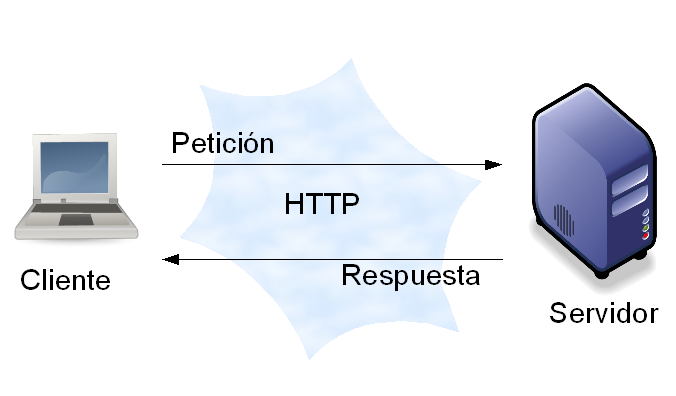

% Desarrollo Web
% Patricio Pérez <patricio.perez@ceinf.cl>
% Primer semestre 2015

# Desarrollo web

## Developers, Developers, Developers!

<video controls data-autoplay src="media/developers-developers-developers.webm"></video>

## Modelo cliente/servidor

Es lo que más usamos día a día, en facebook por ejemplo.

---

# Arquitectura HTTP

## Arquitectura HTTP

Implementa el modelo cliente/servidor, ojearemos un par de conceptos necesarios para entenderla:

* URIs
* Requests
* Códigos de estado
* Verbos HTTP

## URIs

Un *URI* es un identificador único de un recurso, ejs:

* `http://animales.com/perros/5`
* `http://animales.com/anguilas`
* `http://animales.com/anguilas/4/albinas`

## Requests

Un request es una *petición* realizada a un recurso mediante su *URI*, la petición debe indicar un **verbo http**, el que dice si estamos pidiendo, actualizando o enviando información (Aquí enviamos información al servidor).
Un request debe tener una respuesta, la que es entregada al usuario, esta puede tener un código (i.e: 500, 200, el infame error 404, etc).

## Verbos HTTP

Los verbos HTTP más utilizados son:

* `GET`
* `HEAD`
* `POST`
* `PUT`
* `DELETE`
* `PATCH`

## GET

Pide la representación de un recurso específico, el fin es obtener información, no debe haber otro efecto adverso.

---

## Head

Pide una respuesta, del mismo estilo que `GET`, pero sin el cuerpo de la respuesta. Útil para mostrar información en headers, notificar si hay cambios en el contenido (Es decir, ratear un poco de bandwidth al no transferir el body)

---

## POST

Envia información y realiza cambios en recursos, pueden crearse nuevos recursos, realizar cambios sobre recursos existentes. Esta es la acción que hacemos al pinchar '`Enviar`' en un formulario.

---

## PUT

Tambien se envia información, sin embargo es más flexible, ya que se puede interpretar como la creación de un nuevo recurso, o la modificación de uno ya existente.

---

## DELETE

Creo que ya se imaginan que hace.

## PATCH

Realiza modificaciones parciales a un recurso existente, hay que tener ojo, la especificación recomienda que los cambios enviados sean un tipo de diferencia, esta es parseada por el servidor y realiza los cambios pertinentes, al contrario de la creencia común, de enviar una `campo:valor` y esperar que se modifique solo tal campo en el recurso.

---

## Patrones de diseño arquitectónico

Es una solución reconocida (*connotada*) a un problema recurrente de diseño (Como estructuramos nuestra aplicación).

