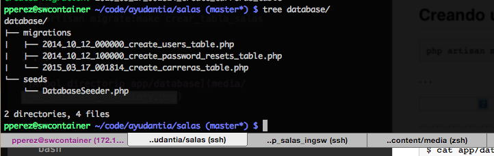
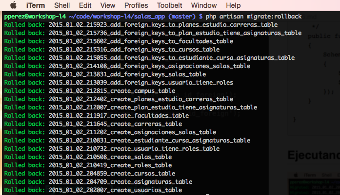
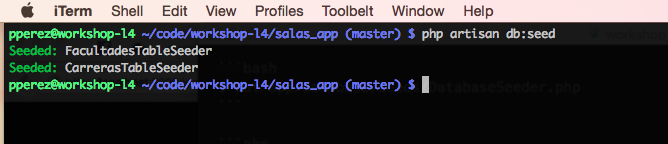
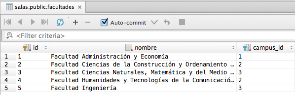

% Laravel 5.0
% Patricio Pérez <patricio.perez@ceinf.cl>
% Primer semestre 2015

# Laravel

---

## Laravel

Laravel es un framework para PHP que implementa el patrón MVC.

. . .

Ya vimos como instalarlo, así que el que no tenga su proyecto listo para trabajar lease todas las diapos anteriores/blogs/etc.

## Laravel

Características agradables que tiene:

* Framework de ruteo.
* Schema Builder + Migraciones.
* ORM *Eloquent*.
* Vistas con *Blade* Templating.
* Manejo de cache.
* Manejo de colas (*Queues*: Redis, Amazon SQS, otras).

## Artisan

*Artisan* es la interfaz de línea de comando de *Laravel*.
Incluye un montón de funciones útiles a la hora de desarrollar:

* Servidor integrado de php (`php artisan serve`).
* Manejo de migraciones (`php artisan migrate`).
* Manejo de estado de la app (`php artisan down | php artisan up`).
* Comandos personalizables.

# Base de datos

## La historia de la migración, el modelo y la semilla

Laravel incluye 3 piezas bien útiles:

## Migraciones de DB

Las *migraciones* son una especie de control de versiones para la base de datos, permitiendo a un equipo de trabajo modificar la estructura de la DB sin tantos problemas.

## Modelos

Los modelos representan la lógica y reglas de nuestra aplicación.
En el framework se utilizan modelos *Eloquent* (Un ORM), para utilizarlos basta con herederar desde la clase `Illuminate\Database\Eloquent\Model`.

## Seeds

Los *seeds* sirven para poblar la base de datos, pueden usarse para dejar la base de datos en su estado inicial (ej: añadir las facultades iniciales de la universidad, agregar docente por defecto para las asignaturas, etc).

# Codeando migraciones

## Crear migraciones

El framework incluye un generador para migraciones:

~~~bash
$ php artisan make:migration --create=carreras create_carreras_table
~~~

. . .

---

Método up() se ejecuta cuando la migración se aplica. Método down() ejecutado cuando la migración se revierte (rollback).

## Añadiendo el Schema Builder

El [Schema Builder](http://laravel.com/docs/5.0/schema) de laravel permite hacer cambios sobre la estructura de la DB:

* Añadir y quitar tablas
* Añadir, renombrar, quitar columnas
* Renombrar columnas
* Agregar/Remover llaves foráneas
* Otros

---

~~~php
<?php

use Illuminate\Database\Schema\Blueprint;
use Illuminate\Database\Migrations\Migration;

class CreateCarrerasTable extends Migration {

	/**
	 * Run the migrations.
	 *
	 * @return void
	 */
	public function up()
	{
		Schema::create('carreras', function(Blueprint $table)
		{
			$table->increments('id');
			$table->string('nombre');
			$table->integer('codigo');
			$table->integer('facultad_id');
			$table->integer('jefe_carrera_rut')->nullable();
			$table->timestamps();
		});
	}

	/**
	 * Reverse the migrations.
	 *
	 * @return void
	 */
	public function down()
	{
		Schema::drop('carreras');
	}

}
~~~

## Llaves foráneas? Yes please!

Generalmente hago esto luego de haber definido todas las demás tablas con sus correspondientes campos. Recuerden que como tal la llave foránea es una restricción, independiente de los campos a los que se refiera.

~~~bash
php artisan make:migration --table=carreras add_foreign_key_to_carreras_table
~~~

---

~~~php
<?php

use Illuminate\Database\Schema\Blueprint;
use Illuminate\Database\Migrations\Migration;

class AddForeignKeyToCarrerasTable extends Migration {

	/**
	 * Run the migrations.
	 *
	 * @return void
	 */
	public function up()
	{
		Schema::table('carreras', function(Blueprint $table)
		{
			$table->foreign('facultad_id')->references('id')->on('facultades');
			$table->foreign('jefe_carrera_rut')->references('rut')->on('usuarios');
		});
	}

	/**
	 * Reverse the migrations.
	 *
	 * @return void
	 */
	public function down()
	{
		Schema::table('carreras', function(Blueprint $table)
		{
			$table->dropForeign('carreras_facultad_id_foreign');
			$table->dropForeign('carreras_jefe_carrera_rut_foreign');
		});
	}

}
~~~

## Ejecutando la migración

## Ahora Rollback

# Codeando modelos

## Crear modelos

~~~bash
$ php artisan make:model Models/Carrera --no-migration
$ cat app/Models/Carrera.php
~~~

---

~~~php
<?php namespace App\Models;

use Illuminate\Database\Eloquent\Model;

class Carrera extends Model {

	//

}
~~~

## Convenciones de un modelo

Laravel tiene un montón de convenciones, esto no es distinto para los modelos Eloquent.
Las convenciones son las siguientes:

* Deben heredar de la clase `Illuminate\Database\Eloquent\Model`.
* El nombre de la tabla es el plural (en ingles) del nombre de la clase, en minúsculas.
* La llave primaria es `id`.
* Al declarar relaciones de db, la llave foránea es `clase_id` e `id`.

## Saltando las convenciones

Es necesario saltarselas, debido a lo del ingles expuesto más atrás.

Es posible saltarse las convenciones, modificando datos en la clase:

* `private $table = 'salas'`
* `private $primaryKey = 'pk'`

## Añadiendo relaciones entre modelos

Como mencioné anteriormente, es posible hacer las típicas relaciones de entidades:

* `1:n`
* `1:1`
* `n:m`

## Relación 1:n

Modelaremos la siguiente relación:

---

~~~bash
$ cat app/Models/Facultad.php
~~~

~~~php
<?php namespace App\Models;

use Illuminate\Database\Eloquent\Model;

class Facultad extends Model
{
    protected $table = 'facultades';
    protected $fillable = ['nombre'];

    public function campus()
    {
        return $this->belongsTo('Campus');
    }
}
~~~

---

~~~bash
$ cat app/models/Campus.php
~~~

~~~php
<?php namespace App\Models;

use Illuminate\Database\Eloquent\Model;

class Campus extends Model
{
    protected $table = 'campus'; // O sino laravel busca la tabla 'campuss'
    protected $fillable = ['nombre', 'direccion'];

    public function facultades()
    {
        return $this->hasMany('Facultad');
    }
}
~~~

---

Listo, la relación y su inverso!

## Relacion n:m

Esta reación es algo más complicada (?), necesitan una tabla pivote (Recuerdan normalizar una db con tía sarita hace un año atrás aprox?)

---

---

Tendremos dos modelos (*Rol* y *Usuario*):

~~~bash
$ cat app/Models/Rol.php
~~~

~~~php
<?php namespace App\Models;

use Illuminate\Database\Eloquent\Model;

class Rol extends Model
{
    protected $table = 'roles';
    protected $fillable = ['nombre'];

    public function usuarios()
    {
        return $this->belongsToMany('Usuario', 'usuario_tiene_roles', 'rol_id', 'usuario_rut')->withTimestamps();
    }
}
~~~

---

~~~bash
$ cat app/models/Usuario.php
~~~

~~~php
<?php namespace App\Models;

use Illuminate\Database\Eloquent\Model;

class Usuario extends Model
{
    protected $primaryKey = 'rut';
    protected $incrementing = false; // El rut no es autoincrementable .. dah
    protected $fillable = ['rut', 'nombres', 'apellidos'];

    public function roles()
    {
        return $this->belongsToMany('Rol', 'usuario_tiene_roles', 'usuario_rut', 'rol_id')->withTimestamps();
    }
}
~~~

# Codeando Seeds

## Crear seed

Desafortunadamente no existen generadores para seeds integrados en laravel, asi que hay que crearlos a manito:

~~~bash
$ cat database/seeds/CampusTableSeeder.php
~~~

---

~~~php
<?php

use Illuminate\Database\Seeder;

class CampusTableSeeder extends Seeder {

	public function run()
	{
		//DB::table('campus')->delete();
		$nombres = ['Macul', 'FAE', 'Centro'];
		
		foreach($nombres as $nombre)
		{
			$campus = Campus::create(['nombre' => $nombre]);
		}
	}

}
~~~

---

Se ejecuta así:

~~~bash
$ php artisan db:seed --class=CampusTableSeeder
~~~

## Ejecutar una serie de seeds

Es latoso ejecutar un montón de seeds, si quitamos el parámetro `class` del comando anterior, se asume que se ejecuta la clase `DatabaseSeeder`, desde esta haremos `$this->call('TablaSeeder')` a todas las clases que queramos.

~~~bash
$ cat app/database/seeds/DatabaseSeeder.php
~~~

---

~~~php
<?php

use Illuminate\Database\Seeder;
use Illuminate\Database\Eloquent\Model;

class DatabaseSeeder extends Seeder {

	/**
	 * Run the database seeds.
	 *
	 * @return void
	 */
	public function run()
	{
		Model::unguard();

		$this->call('UserTableSeeder'); // Aquí!
	}

}
~~~

---

---

## Ejecutarla despues de migrar

Tambien es posible ejecutar los seeds luego de migrar, el comando mágico es:

~~~bash
$ php artisan migrate:refresh --seed
~~~
