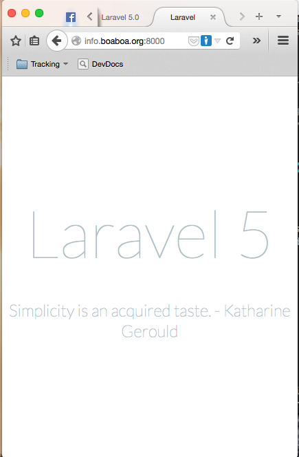

% Laravel 5.0
% Patricio Pérez <patricio.perez@ceinf.cl>
% Primer semestre 2015

# El tintero!

## Haciendo pruebas con la shell de laravel

Es natural que queramos ver si todo lo que hemos hecho funciona, ver algo de datos en la db, en general ver si metimos o no la pata.

. . .

*Laravel* incluye una consola interactiva (o *REPL*) para ir probando código.

---

~~~bash
$ php artisan tinker
~~~

---

Demo time!

---

~~~php
$rol_encargado = App\Models\Rol::create(['nombre' => 'Encargado Campus']);
$encargado_macul = App\Models\User::create(['rut' => '8069139', 'nombres' => 'Ivan Alexis', 'apellidos' => 'Kemp Reyes', 'email' => 'macullallea@utem.cl']);
$rol_encargado->users()->attach($encargado_macul);

$macul = new App\Models\Campus;
$macul->nombre = 'Campus Macul';
$macul->encargado()->associate($encargado_macul);
$macul->save();
$facultad_ing = new App\Models\Facultad;
$facultad_ing->nombre = 'Facultad Ingenieria';
$facultad_ing->campus()->associate($macul);
$facultad_ing->save();

$carrera_informatica = new App\Models\Carrera;
$carrera_informatica->nombre = "Ingenieria en Informatica";
$carrera_informatica->codigo = 21030;
$facultad_ing->carreras()->save($carrera_informatica);
~~~

# Rutas y controladores

## Servidor web

Este punto es importante, serviremos la aplicacion web usando el servidor integrado de php:

~~~bash
php artisan serve
~~~

Basta que abran el browser en [http://localhost:8000](http://localhost:8000)

---

## Rutas

Es necesario definir como interactua el usuario final con nuestra aplicación, para esto se utiliza el framework de *Routing*, este mapea una *URI + verbo HTTP* a un método existente en algún controlador*.

---

~~~bash
cat app/Http/routes.php
~~~

~~~php
<?php

// ...

Route::get('/', 'WelcomeController@index');

Route::get('home', 'HomeController@index');

Route::controllers([
	'auth' => 'Auth\AuthController',
	'password' => 'Auth\PasswordController',
]);
~~~

## Definiendo rutas

Los verbos http son los que la llevan aquí:

~~~php
Route::get('pato', function()
{
    return 'Patoh';
});

Route::post('hola/holaa', function()
{
    return 'Hola World';
});

Route::put('foo/bar', function()
{
    //
});

Route::delete('foo/bar', function()
{
    //
});
~~~

Basta que disparemos con nuestro navegador a las urls correspondientes y deberiamos 

## Pasando parámetros

Hagamoslo más interesante, obtengamos parámetros desde la url:

~~~php
Route::get('hola/{nombre}', function($nombre)
{
    return 'Hola ' . $nombre;
});
~~~

Prueben en su [navegador](http://localhost:8000/hola/patricio)

## Otros detalles

Algunas funcionalidades de rutas:

* Restricciones con expresiones regulares (#valecorby)
* Parámetros por defecto
* Acceder a ellas por nombre (Lo veremos más a fondo)
* Usar subdominios

---

* Usar prefijos
* Binding a modelos (Lo veremos más a fondo)
* Pasar más de un parámetro (ej: /decir/hola/pedro; /decir/saludar/pedro)
* Agrupar rutas (Para ejecución de `middlewares` y `namespaces`, lo veremos...)
