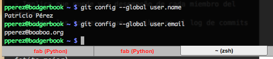
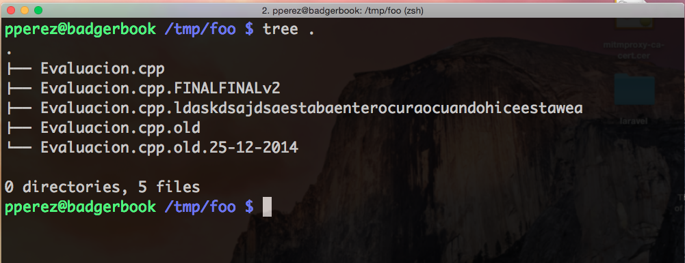
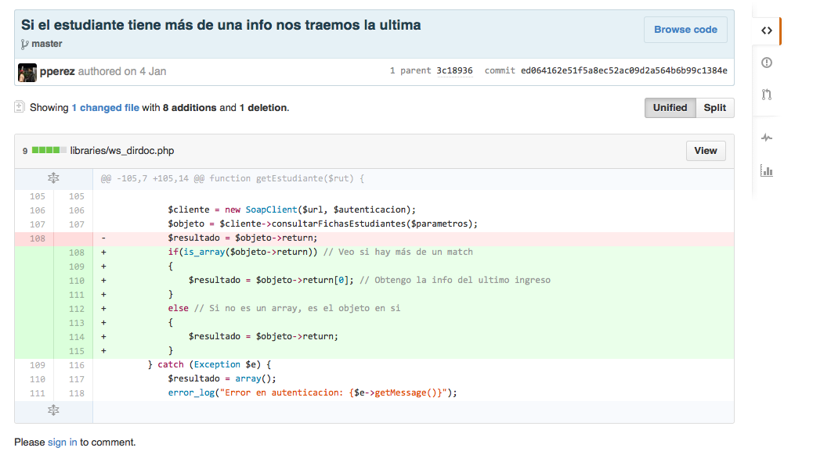

% Workshop Laravel 4
% Patricio Pérez <patricio.perez@ceinf.cl>
% Primer semestre 2015

# Que aprenderemos (Intentaremos?)

## Como no hacerlo enojar ...

. . .

Es un \_poco\_ cascarrabias ...

## Para ello usaremos

----

. . .

Control de versiones distribuido

----

. . .

Framework PHP para buenos tipos!

----

----

. . .

Sistema operativo "_de verdad_"

# Que quedó fuera de este workshop

## Contenidos que no veremos (aún?)

Hay herramientas que se me quedaron en el tintero, pero creo que serían bien útiles para cualquier developer que se respete:

- Pruebas unitarias
- Integración continua (Tambien conocido como CI o Continuous Integration)

# Contenidos

## Contenidos

- Buenas (y malas) prácticas en el ramo (A.K.A Tratando de no hacer rabiar al profe)
- Instalacion del entorno de desarrollo (*Ubuntu + DB + IDE + Git + Framework*)
- Uso básico de linux (Línea de comandos + git(*hub*))
- Uso de manejador de dependencias de PHP: *Composer*
- Introducción rápida al patrón MVC (*Model View Controller*)
- Migraciones de db (*Generación del modelo en DB*)
- ORM (*Object Relational Mapping*): *Eloquent*

---

## Contenidos

- Rutas en el framework, verbos HTTP y controladores resourceful
- Vistas: Templates *Blade*
- Probando código en la terminal: *Tinker*
- Rutas avanzadas (Anidación de recursos, filtros)
- Integración con un servicio REST
- Ejecución de tareas programadas (Mezclando CRON con laravel)
- Deployment en producción (Ubuntu + Apache 2 + PostgreSQL)

# Convenciones

## Convenciones

Estas serán nuestras herramientas a lo largo del workshop (A.K.A Ayudantia):

- Sistema operativo: Linux (*Ubuntu 14.04*)
- Control de versiones: *Git*
- Motor de base de datos: *PostgreSQL*
- IDE: *Eclipse* (O alguno de su gusto)
- Framework **MVC**: *Laravel 4.2*

# Buenas (y malas) prácticas

## Buenas prácticas

- Hay que tener en cuenta que ya estamos viejitos
- No se ustedes, pero hay varias cosas sobre las que no tengo ni p*ta idea.
- Esto más que frustrar al profe (Creanme que lo hará), los frustrará a ustedes.
- Ya que les costará hacer cosas relativamente sencillas, perdiendo mucho tiempo, tiempo en el que podrían estar carreteando por ejemplo.

## Sobre la realización del trabajo

A lo largo de la asignatura verán un monton de conceptos (DRY, YAGNI, metodologías ágiles, PMBOK, etc).

---

- Los estándares estan hechos para que no se odien entre los mismos miembros del team
- La planificación esta pensada para estructurarlos un poco, distribuyan bien el tiempo, y al final le digan al profe que trabajaron bien (Y que eso no sea una falazzììa)

El resumen corto de todo eso (En mi opinión bien vaga) es que mientras esten construyendo el proyecto tengan esto en cuenta:

- Traten de ir mostrando constantemente su trabajo, ya que el cliente puede ser algo especial (A.K.A Los puede mandar a la punta del cerro si hay cosas que no le agraden)
- Planificación (No hagan todo a última hora)
- Estándares (Quizas no los de industrias, ISO, IEEE, sino estándares fijados por ustedes)
- No usen las herramientas porque se las esten imponiendo, no se resistan ლ(´ڡ`ლ) realmente intenten entenderlas y usarlas a futuro!
- Ya dije que deberian preguntar mucho? El feedback es fundamental en el desarrollo de un proyecto, solo traten de que sus preguntas no sean tan ...

## DRY

. . .

- Si están realizando dos secciones de código (Por ejemplo dos partes de un html) y estan difieren muuuuy poco o nada, estan haciendo código de más.
- Este es complicado de mantener (Si cambio uno TENGO que cambiar el otro) y es una pesadilla a medida que crece el proyecto.
- Aprovechen de que el framework les entrega herramientas para combatir esto (Para las vistas html tienen herencia y composición por ejemplo)

## Indentación

A lo largo de la asignatura, probablemente esten mostrando mucho código al profe, al ayudante, o a sus mismos compañeros, nada se agradece más que un buen indentado del código.

. . .

Así que haganse el tiempo, o ...

## Dejen que el IDE lo haga!

## Uso de git

- Salazar sapea el git
- Implica que puede ver desempeño de cada miembro del equipo
- O todas las tonteras que escriben en el log de commits

- Trabajen en sus cuentas individualmente, no todos en un solo usuario
- Llenen correctamente sus perfiles en github (Si ponen fotito mejor)
- Configuren correctamente su correo y nombre en la instalación de git local (Así se pueden distinguir en la rama de commits)
- Que sus commits indiquen (o traten de indicar) que cambio realizaron en el código
- Idealmente usen branches (ramas) al desarrollar, cuando la funcionalidad que agregaron este "lista" hacen merge a su branch principal (e.g: master)

## Perfil

## Config git

## Log de commits

# Instalando el entorno de desarrollo

## Ubuntu

Me imagino que ya sabrán como instalar Ubuntu, pero si tienen dudas podemos organizar una pequeña jornada de instalación en la sala de info ツ
Recuerden, para que no tengamos atados, usaremos la versión 14.04 (Tiene soporte para 5 años más, creo que estamos cubiertos!)

## Instalando el framework y la base de datos

En mi blog ([http://alumnos.informatica.utem.cl/~pperez](http://alumnos.informatica.utem.cl/~pperez)) tengo un tutorial que los dejara listos para desarrollar con laravel, incluye la instalación del motor de base de datos, instalar php, composer, y la cachá de la espada. Lo haremos ahora, preparense!

## Git

Aquí ya empiezo a explicars

## Que es git

Git es un sistema de control de versiones (Conocido como SCM), sus características son:

## Controla las versiones de nuestros ficheros

Cuantas veces les ha ocurrido esto?

----

Git (O cualquier SCM que se respete) les permite ver revisiones de sus ficheros, en la mayoria estas revisiones son representadas por "commits"

----

----

## Es distribuido

Si se cae el servidor de github (Repositorio central en la imagen), aún pueden trabajar, hacer commits, consultar el log, crear branches, y otras operaciones locales.

----

(Ojo! Github no es el único proveedor de git, esta bitbucket y otros, incluso pueden alojarlo en un servidor propio)
