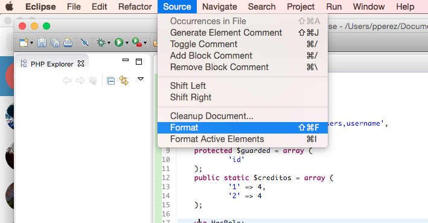
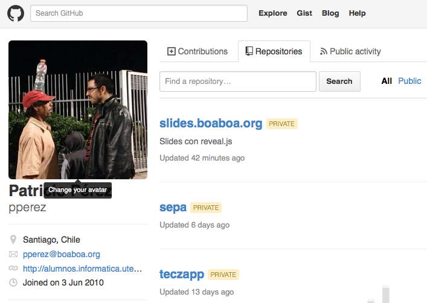
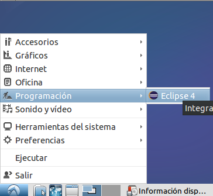
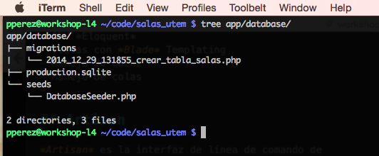
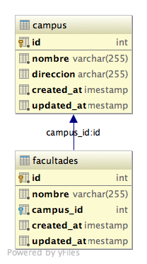

% Workshop Laravel 4
% Patricio Pérez <patricio.perez@ceinf.cl>
% Primer semestre 2015

# Que aprenderemos (Intentaremos?)

## Como no hacerlo enojar ...


. . .

Es un \_poco\_ cascarrabias ...

## Para ello usaremos

----


. . .

Control de versiones distribuido

----


. . .

Framework PHP para buenos tipos!

----


----


. . .

Sistema operativo "_de verdad_"

# Que quedó fuera de este workshop

## Contenidos que no veremos (aún?)

Hay herramientas que se me quedaron en el tintero, pero creo que serían bien útiles para cualquier developer que se respete:

- Pruebas unitarias
- Integración continua (Tambien conocido como CI o Continuous Integration)

# Contenidos

## Contenidos

- Buenas (y malas) prácticas en el ramo (A.K.A Tratando de no hacer rabiar al profe)
- Instalacion del entorno de desarrollo (*Ubuntu + DB + IDE + Git + Framework*)
    - Uso básico de linux (Línea de comandos + git(*hub*))
    - Uso de manejador de dependencias de PHP: *Composer*
- Introducción rápida al patrón MVC (*Model View Controller*)
- Laravel
    - Migraciones de db (*Generación del modelo en DB*)
    - ORM (*Object Relational Mapping*): *Eloquent*

---

## Contenidos

- Laravel
    - Rutas en el framework y controladores *resourceful*
    - Vistas: Templates *Blade*
    - Probando código en la terminal: *Tinker*
    - Rutas avanzadas (Anidación de recursos, filtros)
    - Autenticación (DB, WS, Custom)
    - Helpers (Paths, Custom)
- Tópicos avanzados
    - Integración con un servicio REST
    - Ejecución de tareas programadas (Mezclando CRON con laravel)
    - Deployment en producción (Ubuntu + Apache 2 + PostgreSQL)

# Convenciones

## Convenciones

Estas serán nuestras herramientas a lo largo del workshop (A.K.A Ayudantia):

- Sistema operativo: Linux (*Ubuntu 14.04*)
- Control de versiones: *Git*
- Motor de base de datos: *PostgreSQL*
- IDE: *Eclipse* (O alguno de su gusto)
- Framework **MVC**: *Laravel 4.2*

# Buenas (y malas) prácticas

## Buenas prácticas

<div class="notes">
- Hay que tener en cuenta que ya estamos viejitos
- No se ustedes, pero hay varias cosas sobre las que no tengo ni p*ta idea.
- Esto más que frustrar al profe (Creanme que lo hará), los frustrará a ustedes.
- Ya que les costará hacer cosas relativamente sencillas, perdiendo mucho tiempo, tiempo en el que podrían estar carreteando por ejemplo.
</div>


## Sobre la realización del trabajo

A lo largo de la asignatura verán un monton de conceptos (DRY, YAGNI, metodologías ágiles, PMBOK, etc).

---

<div class="notes">
- Los estándares estan hechos para que no se odien entre los mismos miembros del team
- La planificación esta pensada para estructurarlos un poco, distribuyan bien el tiempo, y al final le digan al profe que trabajaron bien (Y que eso no sea una falazzììa)
</div>

El resumen corto de todo eso (En mi opinión bien vaga) es que mientras esten construyendo el proyecto tengan esto en cuenta:

- Traten de ir mostrando constantemente su trabajo, ya que el cliente puede ser algo especial (A.K.A Los puede mandar a la punta del cerro si hay cosas que no le agraden)
- Planificación (No hagan todo a última hora)
- Estándares (Quizas no los de industrias, ISO, IEEE, sino estándares fijados por ustedes)
- No usen las herramientas porque se las esten imponiendo, no se resistan ლ(´ڡ`ლ) realmente intenten entenderlas y usarlas a futuro!
- Ya dije que deberian preguntar mucho? El feedback es fundamental en el desarrollo de un proyecto, solo traten de que sus preguntas no sean tan ...

## DRY

. . .

- Si están realizando dos secciones de código (Por ejemplo dos partes de un html) y estan difieren muuuuy poco o nada, estan haciendo código de más.
- Este es complicado de mantener (Si cambio uno TENGO que cambiar el otro) y es una pesadilla a medida que crece el proyecto.
- Aprovechen de que el framework les entrega herramientas para combatir esto (Para las vistas html tienen herencia y composición por ejemplo)

## Indentación

A lo largo de la asignatura, probablemente esten mostrando mucho código al profe, al ayudante, o a sus mismos compañeros, nada se agradece más que un buen indentado del código.

. . .

Así que haganse el tiempo, o ...

## Dejen que el IDE lo haga!



## Uso de git

<div class="notes">
- Salazar sapea el git
- Implica que puede ver desempeño de cada miembro del equipo
- O todas las tonteras que escriben en el log de commits
</div>

- Trabajen en sus cuentas individualmente, no todos en un solo usuario
- Llenen correctamente sus perfiles en github (Si ponen fotito mejor)
- Configuren correctamente su correo y nombre en la instalación de git local (Así se pueden distinguir en la rama de commits)
- Que sus commits indiquen (o traten de indicar) que cambio realizaron en el código
- Idealmente usen branches (ramas) al desarrollar, cuando la funcionalidad que agregaron este "lista" hacen merge a su branch principal (e.g: master)
- No agreguen binarios al proyecto en git, tampoco las librerías del proyecto.

## Perfil



## Config git


## Log de commits


# Instalando el entorno de desarrollo

## Ubuntu

<div class="notes">
> Yo mismo: **Mismo, recuerda!!**
> Hay que ver que día nos juntamos en la sala de info a ver comandos linux por lo bajo
</div>

Me imagino que ya sabrán como instalar Ubuntu, pero si tienen dudas podemos organizar una pequeña jornada de instalación en la sala de info ツ
Recuerden, para que no tengamos atados, usaremos la versión 14.04 (Tiene soporte para 5 años más, creo que estamos cubiertos!)

---

De hecho, juntemonos en la sala igual, lleven sus notebooks, y veremos los comandos básicos para la línea de comandos de Linux

## Torpedo básico de comandos UNIX

- Usar **TAB** para completar comandos, nombres de ficheros, siempre que se pueda!
- `cd directorio` Ingresa a un directorio
- `cat fichero.txt` Muestra en pantalla el contenido de un fichero
- Cuando se trabajan directorios `.` se refiere al directorio actual, `..` se refiere al padre del directorio actual, de hecho `../..` entraria al padre del padre del directorio actual (abuelo??)
- Nuestro home (Donde se guardan todas nuestras leseras) es por defecto `/home/usuario`, un atajo es `~` (ej: ´~/Descargas´ equivale a ´/home/usuario/Descargas´)

----

- Usar apt para manejar paquetes es super sencillo:
    * `apt-get install paquete otropaquete` Instalar
    * `apt-get remove paquete otropaquete` Desinstalar
    * `apt-cache search palabra buscar php` Buscar paquetes, en descripción etc, pueden ser muchas palabras
    * `apt-get update` Actualiza la base de datos de paquetes
    * `apt-get dist-upgrade` Actualiza todos los paquetes del sistema
- Usar `sudo` antes de cualquier comando que necesite permisos de administrador (ej: instalar paquetes con apt, modificar ficheros en `/etc`, etc)

## Instalando el framework y la base de datos

En mi blog ([http://alumnos.informatica.utem.cl/~pperez](http://alumnos.informatica.utem.cl/~pperez)) tengo un tutorial que los dejará listos para desarrollar con laravel, incluye la instalación del motor de base de datos, instalar php, composer, y la cachá de la espada. Lo haremos ahora, preparense!

## Git

Aquí ya empiezo a explicars

## Que es git


Git es un sistema de control de versiones (Conocido como SCM), sus características son:

----

### Controlar las versiones de nuestros ficheros

Cuantas veces les ha ocurrido esto?


----

[Git](http://git-scm.com/) (O cualquier SCM que se respete) les permite ver revisiones de sus ficheros, en la mayoria estas revisiones son representadas por "commits"

----


----


## Es distribuido

<div class="notes">
- CVCS: "Centralized Version Control System" (ej: SVN, CVS)
- DVCS: "Distributed Version Control System" (ej: Git, Mercual, Bazaar)
</div>


Si se cae el servidor de github (Repositorio central en la imagen), aún pueden trabajar, hacer commits, consultar el log, crear branches, y otras operaciones locales.

----

(Ojo! [Github](http://github.com) no es el único proveedor de git, esta [bitbucket](http://bitbucket.org) y otros, incluso pueden alojarlo en un servidor propio)

## Y bueno, al ataque

- El primer paso sería entrar a [github](http://github.com) y crearnos una cuenta
- Ahora debemos crear una llave ssh (Abran sus terminales y tipeen):

- ```bash
git config --global user.name "Patricio Pérez"
git config --globa user.email pperez@boaboa.org
git config --global color.ui auto
ssh-keygen -t rsa -C pperez@badgerbook
```

- Ver el contenido de `.ssh/id_rsa.pub` y agregarla a Github (En la web 'Settings → SSH keys → Add SSH key')

---

<iframe src="http://showterm.io/3eb31771d1635f586f6c4#slow" width="800" height="520"></iframe>

---


---

- Crear el repositorio ('Create new... → New repository')

. . .


- Puntos extras si saben como licenciar su proyecto!

----

Ahora a clonar el repositorio!
Vamos a la pagina del repositorio y copiamos la URL de clonado SSH (Parte inferior derecha), luego en la terminal:

```bash
cd ~
mkdir code
git clone git@github.com:pperez/app_evaluaciones_ingsw.git
```

## Ta-Dah!


Su repositorio esta en `~/code/app_evaluaciones_ingsw`

## Comandos git

<div class="notes">
- `git checkout -b nueva_rama` (Hace una nueva rama basada en la actual)
- `git commit -m "mensaje"` (Hace un commit con el mensaje especificado en el -m)
- `git checkout master` cambia a la branch que queramos
- `git merge otrarama` hace un merge de la otra rama, cuidado con los problemas de merge!
</div>


---

<div class="notes">
- El push requiere conexión al server (en este caso github)
- Hay que tener cuidado con los merge y como manejarlos
</div>


## Terminando con git

Eso sería lo básico, donde encontrar más:

. . .

Github tiene una buena sección de recursos ([https://help.github.com/articles/good-resources-for-learning-git-and-github/](https://help.github.com/articles/good-resources-for-learning-git-and-github/))

Selección personal:

- Cheatsheet (Torpedo) de git en español ([https://training.github.com/kit/downloads/es/github-git-cheat-sheet.pdf](https://training.github.com/kit/downloads/es/github-git-cheat-sheet.pdf))
- Pro Git ([http://progit.org](http://progit.org))
- Github Guides ([https://guides.github.com/](https://guides.github.com/))

## Instalar el IDE

Como mencioné anteriormente, usaremos [Eclipse](http://eclipse.org) con *PDT* (PHP Development Tools), los pasos:

```bash
sudo apt-get install axel
axel -n50 http://carroll.aset.psu.edu/pub/eclipse/technology/epp/downloads/release/luna/SR1/eclipse-php-luna-SR1-linux-gtk-x86_64.tar.gz
sudo tar xzvf eclipse-php-luna-SR1-linux-gtk-x86_64.tar.gz -C /opt
sudo ln -s /opt/eclipse/eclipse /usr/local/bin
sudo wget http://git.io/VhjClg -O /usr/share/applications/eclipse.desktop
rm eclipse-php-luna-SR1-linux-gtk-x86_64.tar.gz
```

---

<iframe src="http://showterm.io/a8fa8b6ec4d10ef0b342f#slow" width="800" height="520"></iframe>

---



## Configurar el IDE contra el directorio del proyecto

Placeholder ;)

## Usando Composer


## Que es Composer

*Composer* es un manejador de dependencias para *PHP*.

. . .

Es decir, especificar de que librerías depende nuestro proyecto.

. . .

Se puede ver el listado de paquetes disponibles en composer en [Packagist](https://packagist.org/)

## Como se usa

Tiene dos modos, *local* y *global*.

## Composer global

Este instala los paquetes de composer en el *home* del usuario.

. . .

```bash
composer global require "laravel/installer=~1.1"
```

. . .


## Composer local

Este instala los paquetes en el directorio `vendor` del proyecto, las dependencias se definen en el fichero `composer.json` en la raiz del proyecto

. . .

```bash
composer require resty/resty:@stable
```

. . .


---


## Composer y git

Cuando generan un proyecto con el instalador de laravel, se incluye un fichero `.gitignore`, este hace que git ignore ciertos ficheros, entre ellos se incluye todo el directorio `vendor`, ya que al hacer el `composer update` se instalan las librerías, haciendo innecesario tenerlo en git.

## Resumen Composer

1. Instalar composer
2. Añadir librerias usando `composer require` o modificando `composer.json`
3. Ejecutar `composer update` en la raiz del proyecto para instalar las librerías
4. Profit!!

# Introducción al patrón MVC

## Que es un patrón de diseño arquitectónico

Es una solución reconocida (connotada) a un problema recurrente de diseño (Como estructuramos nuestra aplicación).

## MVC

<div class="notes">
- Modelo: Objetos del mundo real, del dominio del problema, maneja datos, lógica y reglas de la app (ej: Usuario, Estudiante)
- Vista: Representación de salida al usuario (ej: HTML, JSON, XML, etc)
- Controlador: Lógica de interacción con el usuario, recibe, convierte datos e interactua con modelos y vistas
</div>

El patrón que utilizaremos será *MVC* o *M*odel *V*iew *C*ontroller, este separa la aplicación en 3 capas:

- Modelos
- Vistas
- Controladores

## Modelos

<div class="notes">
Blog: (Modelos: Entradas, Usuarios, Comentarios)
Controladores: EntradasController, UsersController, ComentariosController

/entradas/\{id\}/comentarios
/usuarios/
</div>

Los modelos se refiere al conjunto de clases que representa nuestro dominio del problema (Relación con el paradigma orientado a objetos).

## Modelos

*Laravel* nos da una herramienta llamada *Eloquent* para manejar los modelos, estos tienen relación directa con nuestra base de datos (*Eloquent* es un ORM, este mapea objetos a filas de base de datos), el ORM automáticamente construira consultas para la base de datos.

## Modelos

El ORM permite trabajar los objetos, por ejemplo, `Modelo::all()` nos entregará una lista con todos los objetos de esa clase, `Modelo::find(5)` entregará el objeto cuya llave primaria sea igual a 5. Se pueden pedir otras cosas al ORM, como condiciones `where` o consultar relaciones `1/n`.

. . .

En fin, si quiere más información, lo veremos prontamente, por este mismo horario, mismo canal.

## Pequeño parentesis

Veremos un poquito de la arquitectura HTTP, para ello ojearemos a groso modo:

- URIs
- Requests
- Códigos de estado
- Verbos HTTP

## URIs

Un *URI* es un identificador único de un recurso, ejs:

- `http://animales.com/perros/5`
- `http://animales.com/anguilas`
- `http://animales.com/anguilas/4/albinas`

## Requests

Un request es una *petición* realizada a un recurso mediante su *URI*, la petición debe indicar un **verbo http**, el que dice si estamos pidiendo, actualizando o enviando información (Aquí enviamos información al servidor).
Un request debe tener una respuesta, la que es entregada al usuario, esta puede tener un código (i.e: 500, 200, el infame error 404, etc).

---


## Códigos de estado

---

<iframe src="http://showterm.io/12fd52747a8d4d4029c90#slow" width="800" height="500"></iframe>

## Verbos HTTP

Los verbos HTTP más utilizados son:

- `GET`
- `HEAD`
- `POST`
- `PUT`
- `DELETE`
- `PATCH`

## GET

Pide la representación de un recurso específico, el fin es obtener información, no debe haber otro efecto adverso.

---


## Head

Pide una respuesta, del mismo estilo que `GET`, pero sin el cuerpo de la respuesta. Útil para mostrar información en headers, notificar si hay cambios en el contenido (Es decir, ratear un poco de bandwidth al no transferir el body)

---


## POST

Envia información y realiza cambios en recursos, pueden crearse nuevos recursos, realizar cambios sobre recursos existentes. Esta es la acción que hacemos al pinchar '`Enviar`' en un formulario.

---


## PUT

Tambien se envia información, sin embargo es más flexible, ya que se puede interpretar como la creación de un nuevo recurso, o la modificación de uno ya existente.

---


## DELETE

Creo que ya se imaginan que hace.

## PATCH

Realiza modificaciones parciales a un recurso existente, hay que tener ojo, la especificación recomienda que los cambios enviados sean un tipo de diferencia, esta es parseada por el servidor y realiza los cambios pertinentes, al contrario de la creencia común, de enviar una `campo:valor` y esperar que se modifique solo tal campo en el recurso.

---


## Controladores

Los controladores son la forma en las que interactuamos con la aplicación, en el caso particular de los frameworks web que implementan MVC las acciones se realizan a través de una URI y de verbos HTTP, ejemplos:

- `GET /perros`
- `POST /perros`
- `GET /perros/5`
- `DELETE /perros/10`

## Controladores

Cada ruta de la aplicación (URI) y un verbo http correspondiente deben mapear a un método de un controlador, los métodos de un controlador pueden no recibir parámetros (ej: un index) o recibirlos (ej: mostrar el recurso 5).

. . .

El encargado de mapear una URI + verbo a un método es el framework de `Routing` (El que veremos en detalle más)

## Vistas

Es la representación de un recurso, presentada al usuario. Estás pueden tener distintos formatos, entre ellos:

- XML
- JSON
- HTML
- PDF

## MVC


# Laravel

---


---

## Laravel

Laravel es un framework para PHP que implementa el patrón MVC.

. . .

Ya vimos como instalarlo, así que el que no tenga su proyecto listo para trabajar lease todas las diapos anteriores/blogs/etc.

## Laravel

Características agradables que tiene:

- Framework de ruteo
- Schema Builder + Migraciones
- ORM *Eloquent*
- Vistas con *Blade* Templating
- Manejo de cache
- Manejo de colas (*Queues*: Redis, Amazon SQS, otras)

## Artisan

*Artisan* es la interfaz de línea de comando de *Laravel*.
Incluye un montón de funciones útiles a la hora de desarrollar:

- Servidor integrado de php (`php artisan serve`)
- Manejo de migraciones (`php artisan migrate`)
- Manejo de estado de la app (`php artisan down | php artisan up`)

# Migraciones de DB

Las *migraciones* son un tipo de control de versiones para la base de datos, permitiendo a un equipo de trabajo modificar la estructura de la DB sin tantos problemas.

## Creando una migración

```bash
php artisan migrate:make crear_tabla_salas
```

. . .



---

```bash
$ cat app/database/migrations/2014_12_29_131855_crear_tabla_salas.php
```

```php
<?php

use Illuminate\Database\Schema\Blueprint;
use Illuminate\Database\Migrations\Migration;

class CrearTablaSalas extends Migration {

	/**
	 * Run the migrations.
	 *
	 * @return void
	 */
	public function up()
	{
		//
	}

	/**
	 * Reverse the migrations.
	 *
	 * @return void
	 */
	public function down()
	{
		//
	}

}
```

---

No hay tanta magia en el fichero, el método up() se ejecuta cuando la migración se aplica, mientras que el método down() cuando la migración se revierte (rollback).

## Añadiendo el Schema Builder

El [Schema Builder](http://laravel.com/docs/4.2/schema) de laravel permite hacer cambios sobre la estructura de la DB:

- Añadir y quitar tablas
- Añadir, renombrar, quitar columnas
- Renombrar columnas
- Agregar/Remover llaves foráneas
- Otros

## Ejemplo

```php
<?php

use Illuminate\Database\Migrations\Migration;
use Illuminate\Database\Schema\Blueprint;

class CreateUsuariosTable extends Migration {

	/**
	 * Run the migrations.
	 *
	 * @return void
	 */
	public function up()
	{
		Schema::create('usuarios', function(Blueprint $table)
		{
			$table->integer('rut');
          $table->string('nombres');
          $table->string('apellidos');
          $table->string('email')->unique();
          $table->integer('telefono')->nullable();
          $table->primary('rut');
			$table->timestamps();
		});
	}
```

---

```php

	/**
	 * Reverse the migrations.
	 *
	 * @return void
	 */
	public function down()
	{
		Schema::drop('usuarios');
	}

}
```

## Agregando llaves foráneas

```php
<?php

use Illuminate\Database\Migrations\Migration;
use Illuminate\Database\Schema\Blueprint;

class AddForeignKeysAsignacionesSalasTable extends Migration {

	/**
	 * Run the migrations.
	 *
	 * @return void
	 */
	public function up()
	{
		Schema::table('asignaciones_salas', function(Blueprint $table)
		{
			$table->foreign('sala_id')->references('id')->on('salas');
			$table->foreign('curso_id')->references('id')->on('cursos');
		});
	}
```

---

```php

	/**
	 * Reverse the migrations.
	 *
	 * @return void
	 */
	public function down()
	{
		Schema::table('asignaciones_salas', function(Blueprint $table)
		{
			$table->dropForeign('asignaciones_salas_sala_id_foreign');
			$table->dropForeign('asignaciones_salas_curso_id_foreign');
		});
	}

}

```

## Ejecutando la migración


## Ahora Rollback


## Añadiendo seeds

Los *seeds* (o semillas) sirven para poblar la base de datos, pueden usarse para dejar la base de datos en su estado inicial (ej: añadir las facultades iniciales de la universidad, agregar docente por defecto para las asignaturas, etc).

---

Para generar un seed, hay que crear un fichero en `app/databases/seeds`, ej: `CampusTableSeeder.php`:

```bash
$ cat app/databases/seeds/CampusTableSeeder.php
```

```php
<?php

class CampusTableSeeder extends Seeder {

	public function run()
	{
		//DB::table('campus')->delete();
		$nombres = ['Macul', 'FAE', 'Centro'];
		
		foreach($nombres as $nombre)
		{
			$campus = Campus::create(['nombre' => $nombre]);
		}
	}

}
```

---

Y ejecutarlo así:

```bash
$ php artisan db:seed --class=CampusTableSeeder
```


## Ejecutando muchos seeds

Es posible ejecutar una serie de seeds secuencialmente con un comando *artisan*:

```bash
php artisan db:seed
```

---

Para esto basta que agreguemos una llamada al fichero `app/databases/seeds/DatabaseSeeder.php`:

```bash
$ cat app/database/seeds/DatabaseSeeder.php
```

```php
<?php

class DatabaseSeeder extends Seeder {

	/**
	 * Run the database seeds.
	 *
	 * @return void
	 */
	public function run()
	{
		Eloquent::unguard();

		$this->call('CampusTableSeeder'); // Aquí!
	}

}
```

---


---


# Generando modelos

## Modelos

Los modelos representan la lógica y reglas de nuestra aplicación.
En el framework se utilizan modelos *Eloquent* (Un ORM), para utilizarlos basta con herederar desde la clase `Eloquent`.

## Estructura de un modelo

Laravel tiene un montón de convenciones, esto no es distinto para los modelos Eloquent.
Las convenciones son las siguientes:

- Deben heredar de la clase `Eloquent`
- El nombre de la tabla es el plural (en ingles) del nombre de la clase, en minúsculas.
- La llave primaria es `id`
- Al declarar relaciones de db, la llave foránea es `clase_id` e `id`.

---

```bash
$ cat app/models/Carrera.php
```

```php
<?php

class Carrera extends \Eloquent
{
    // TODO: Agregar metodo jefe de carrera
    protected $fillable = ['nombre', 'codigo'];
}
```

## Saltando las convenciones

Es posible saltarse las convenciones, modificando datos en la clase:

- `private $table = 'salas'`
- `private $primaryKey = 'pk'`

## Añadiendo relaciones entre modelos

Como mencioné anteriormente, es posible hacer las típicas relaciones de entidades:

- 1:n
- 1:1
- n:m

## Relación 1:n

Modelaremos la siguiente relación:



---

```bash
$ cat app/models/Facultad.php
```

```php
<?php

class Facultad extends \Eloquent
{
    protected $table = 'facultades';
    protected $fillable = ['nombre'];

    public function campus()
    {
        return $this->belongsTo('Campus');
    }
}
```

---

```bash
$ cat app/models/Campus.php
```

```php
<?php

class Campus extends \Eloquent
{
    protected $table = 'campus'; // O sino laravel busca la tabla 'campuss'
    protected $fillable = ['nombre', 'direccion'];

    public function facultades()
    {
        return $this->hasMany('Facultad');
    }
}
```

---

Listo, la relación y su inverso!

## Probando ...

Es típico que queremos hacer pruebas (?), ver si la vaina esta andando o si metimos la pata.

. . .

*Laravel* trae una herramienta bien útil, llamada **tinker**, esta nos provee una consola interactiva (o *REPL*) para ir probando código.

---

```bash
php artisan tinker
```

---

<iframe src="http://showterm.io/d8dc1bf185feb52cbb097#slow" width="800" height="520"></iframe>

---

```php
$facultad = Facultad::first(); // Obtiene el primer registro del modelo Facultad
$facultad->nombre; // Podemos acceder a las columnas en el registro
$carrera = new Carrera; // Instanciar una nueva carrera
$carrera->nombre = 'Ingenieria en comercio interestelar galactico'; // Rellenar un campo
$carrera->codigo = 21099;
$facultad->carreras()->save($carrera); // Guardar usando la relación que creamos anteriormente
```

## Relacion n:m

Esta reación es algo más complicada (?), necesitan una tabla pivote (Recuerdan normalizar una db con tía sarita hace un año atrás aprox?)

---


---

Tendremos dos modelos (*Rol* y *Usuario*):

```bash
$ cat app/models/Rol.php
```

```php
<?php

class Rol extends \Eloquent
{
    protected $table = 'roles';
    protected $guarded = ['id', 'nombre'];

    public function usuarios()
    {
        return $this->belongsToMany('Usuario', 'usuario_tiene_roles', 'rol_id', 'usuario_rut')->withTimestamps();
    }
}
```

---

```bash
$ cat app/models/Usuario.php
```

```php
<?php

class Usuario extends \Eloquent
{
    protected $primaryKey = 'rut';
    protected $incrementing = false; // El rut no es autoincrementable .. dah
    protected $fillable = ['rut', 'nombres', 'apellidos'];

    public function roles()
    {
        return $this->belongsToMany('Rol', 'usuario_tiene_roles', 'usuario_rut', 'rol_id')->withTimestamps();
    }
}
```

## Experimentando

Con lo visto ya deberian poder armar el modelo de datos completo en el framework y quedaria experimentar:

---

```php
$usuario = Usuario::find(12345); // Si no lo consigue, esto es NULL
$roles = $usuario->roles;
foreach($roles as $rol)
{
    echo $rol->nombre . "\n";
}
$asignatura = Asignatura::create([
    'codigo' => 'INF-614',
    'nombre' => 'Comunicación de Datos'
])
echo $asignatura->id;
```

# Rutas y controladores

## Rutas

Es necesario definir como interactua el usuario final con nuestra aplicación, para esto se utiliza el framework de *Routing*, este mapea una *URI + verbo HTTP* a un método existente en algún controlador*.

---

```bash
$ cat app/routes.php
```

```php
<?php

/*
|--------------------------------------------------------------------------
| Application Routes
|--------------------------------------------------------------------------
|
| Here is where you can register all of the routes for an application.
| It's a breeze. Simply tell Laravel the URIs it should respond to
| and give it the Closure to execute when that URI is requested.
|
*/

Route::get('/', function()
{
	return View::make('hello');
});
```

## Gracias del framework de routing

El framework de routeo de laravel incluye ciertas gracias:

- Mapear en función del verbo http usado.
- Mapear a más de un verbo http.
- Filtros (Pre y Post Request).
- Agrupar rutas (Se pueden agregar prefijos o filtros).
- Forzar uso de SSL.
- Recibir parámetros.
- Mapear a un modelo (*Model Binding*)

# Fin
